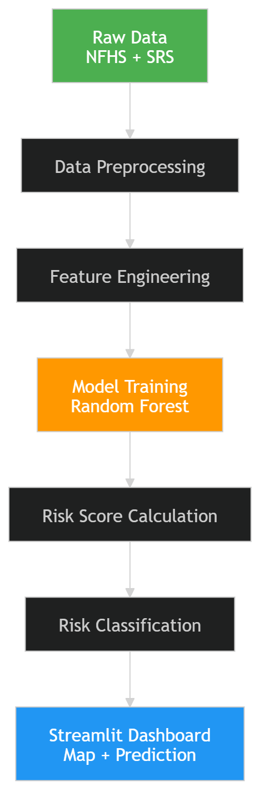
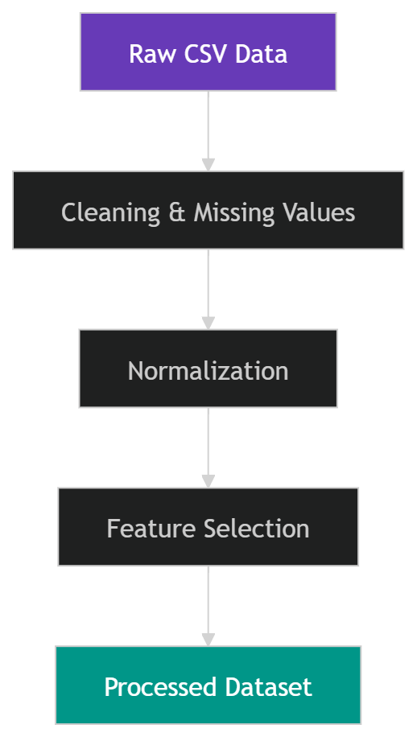
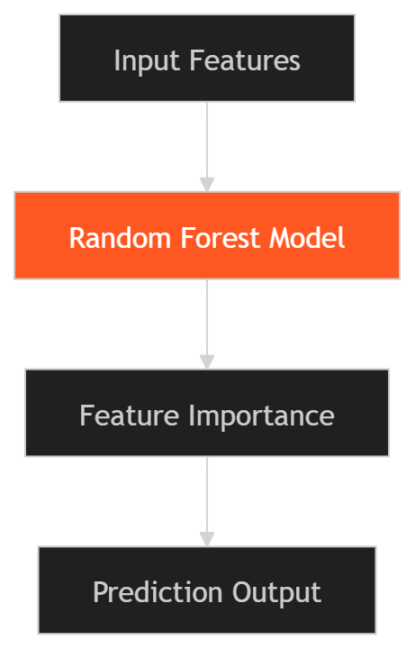
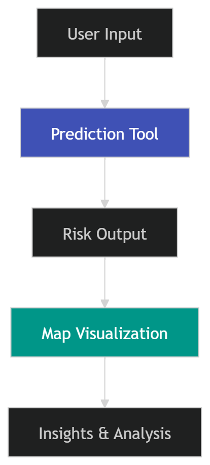

# 🧠 Child Mortality Risk Analysis in India 🇮🇳

## 📌 Overview

This project analyzes and predicts **child mortality risk across Indian states** using real-world healthcare data and machine learning.

It combines:

* 📊 Data Analysis (NFHS + SRS datasets)
* 🤖 Machine Learning (Random Forest)
* 🌍 Interactive Visualization (Streamlit Dashboard)

The system helps identify **high-risk regions** and provides **interpretable insights** for better decision-making.

---

## 🎯 Objectives

* Identify key factors influencing child mortality
* Build a predictive model using real-world data
* Visualize state-wise risk distribution
* Provide explainable insights for users and policymakers

---

## 🧩 Key Features

### 🔮 1. Risk Prediction Tool

* User inputs health indicators:

  * Immunization
  * Stunting
  * Wasting
  * Female Literacy
  * Sanitation
* Outputs:

  * Risk Score (0–1)
  * Risk Category (Low / Medium / High)
  * Key contributing factors
  * Actionable recommendations

---

### 🌍 2. Interactive India Map

* State-wise risk visualization
* Color-coded risk categories:

  * 🟢 Low Risk
  * 🟠 Medium Risk
  * 🔴 High Risk
* Hover-based insights (user-friendly interpretation)
* Clean and intuitive UI

---

### 📊 3. Data Analysis & Insights

* Cause-wise mortality analysis (SRS data)
* Category distribution (communicable vs non-communicable)
* Feature importance from ML model
* Risk distribution across states

---

## 🔄 System Architecture



This diagram shows how raw data is transformed into actionable insights using preprocessing, feature engineering, and machine learning.

---

## 📊 Data Pipeline



* Raw datasets are cleaned and normalized
* Relevant features are selected
* Final processed dataset is used for modeling

---

## 🤖 Model Workflow



* Input features are fed into a Random Forest model
* Model identifies important factors
* Outputs predictions and feature importance

---

## 🖥️ Dashboard Flow



* User interacts with prediction tool
* Model generates risk output
* Results are visualized via dashboard and map

---

## 🧠 Machine Learning Model

* **Algorithm:** Random Forest
* **Accuracy:** ~87%
* **Key Features:**

  * Stunting (most influential)
  * Wasting
  * Sanitation
  * Female Literacy
  * Immunization

---

## 📈 Risk Calculation Logic

A hybrid approach is used for stable and interpretable predictions:

### 🔹 Weighted Risk Score

Risk Score is calculated as:

* 30% → Stunting
* 30% → Wasting
* 15% → Immunization (inverse)
* 15% → Female Literacy (inverse)
* 10% → Sanitation (inverse)

---

### 🔹 Risk Categories

| Score Range | Category    |
| ----------- | ----------- |
| 0 – 0.33    | Low Risk    |
| 0.33 – 0.66 | Medium Risk |
| 0.66 – 1    | High Risk   |

---

## 📊 Key Insights

* Malnutrition (stunting & wasting) is the **primary driver of child mortality**
* High immunization alone does not guarantee low risk
* Significant **regional inequality** exists across states
* Central and eastern India show higher risk clusters

---

## 🗂️ Project Structure

```
Child_Mortality_India/
│
├── data/
│   ├── raw/
│   │   ├── nfhs/
│   │   ├── srs/
│   │   └── india_states.geojson
│   │
│   └── processed/
│       ├── nfhs_with_risk_scores.csv
│       ├── child_death_category_srs.csv
│       └── child_death_causes_srs.csv
│
├── src/
│   ├── data/
│   ├── features/
│   ├── models/
│   └── visualization/
│
├── app/
│   ├── app.py
│   └── components/
│       ├── overview.py
│       ├── map_view.py
│       └── prediction.py
│
├── assets/
│   ├── system_flow.png
│   ├── data_pipeline.png
│   ├── model_flow.png
│   └── dashboard_flow.png
│
├── outputs/
│   ├── figures/
│   └── models/
│       └── random_forest_model.pkl
│
├── notebooks/
├── requirements.txt
└── README.md
```

---

## ⚙️ How to Run

### 1️⃣ Install dependencies

```
pip install -r requirements.txt
```

### 2️⃣ Run pipeline (optional)

```
python main.py
```

### 3️⃣ Launch dashboard

```
streamlit run app/app.py
```

---

## ⚠️ Disclaimer

This project uses publicly available geographic datasets.

* Disputed regions (e.g., parts of Jammu & Kashmir, Ladakh) may not be fully represented
* Boundaries are for analytical and visualization purposes only
* This does not reflect official political boundaries

---

## 🚀 Future Improvements

* SHAP-based model explainability
* District-level analysis
* Time-series forecasting
* Real-time data integration
* Deployment with API support

---

## 👨‍💻 Author

Developed as part of an **AI/ML + Data Science project** focused on solving real-world healthcare challenges in India.

---
